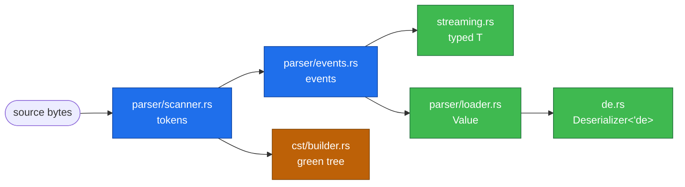

# noyalib internals

A contributor-facing map of how the noyalib core library is laid
out. This is distinct from the workspace-level
[`doc/ARCHITECTURE.md`](../../../doc/ARCHITECTURE.md), which covers
the *why* — this file covers the *where*. If you're trying to figure
out which file to open to make a change, start here.

## Module map

```text
crates/noyalib/src/
├── lib.rs                 # crate root: re-exports + #[doc] hook
├── parser/
│   ├── mod.rs             # re-exports
│   ├── scanner.rs         # ~3000 lines — token stream from bytes
│   ├── events.rs          # token → event stream (anchor/tag attachment)
│   └── loader.rs          # event stream → Value tree
├── streaming.rs           # event stream → typed T (no Value alloc)
├── value.rs               # owned Value enum, Mapping, MappingAny
├── borrowed.rs            # zero-copy BorrowedValue<'a>
├── ser.rs                 # Value → YAML text (the formatter)
├── fmt.rs                 # CST-aware formatter config
├── de.rs                  # Deserializer<'de>, ParserConfig, YamlVersion
├── error.rs               # Error enum, Location, source-radius rendering
├── document.rs            # multi-document load_all helpers
├── cst/                   # the lossless green tree (rowan-shape)
│   ├── document.rs        # public Document type and edit API
│   ├── builder.rs         # token stream → green tree
│   ├── format.rs          # CST-preserving formatter
│   ├── green.rs           # immutable green-tree primitives
│   └── ...                # anchor/entry/syntax helpers
├── path.rs                # `a.b[0].c` query paths
├── span_context.rs        # span side-table for Spanned<T>
├── spanned.rs             # Spanned<T> deserialise
├── flattened.rs           # #[serde(flatten)] support
├── anchors.rs             # AnchorRegistry (Rc / Arc variants)
├── tag_registry.rs        # custom !tag handler registry
├── interner.rs            # KeyInterner for repeated-key streams
├── parallel.rs            # rayon multi-document parsing (feature-gated)
├── policy.rs              # security policies (DenyAnchors, etc.)
├── simd.rs                # SIMD/SWAR primitives (feature-gated)
├── base64.rs              # !!binary tag handling
├── compat/
│   └── serde_yaml.rs      # serde_yaml 0.9 drop-in shim
├── with/                  # serde adapter modules (singleton_map etc.)
├── schema.rs              # JSON Schema codegen + validation surface
├── schema_codegen.rs      # rustdoc-driven schema generation
├── schema_validate.rs     # JSON Schema 2020-12 validation
├── figment.rs             # figment::Provider integration
├── diagnostic.rs          # miette fancy renderer integration
├── robotics.rs            # Degrees / Radians / StrictFloat newtypes
├── policy.rs              # Safe-YAML pluggable policies
├── comments.rs            # comment capture (load_comments)
└── prelude.rs             # internal prelude
```

## The two parse paths

noyalib has two *parallel* parse paths that share the scanner
token stream:



- **Streaming path** (default for `from_str::<T>`): events are
  consumed lazily, deserialised directly into `T`, no `Value`
  intermediate. Lowest memory + fastest.
- **Loader path** (used when the caller wants a dynamic-shape
  `Value`, span-tracking, or strict-mode unknown-key detection):
  events build a full `Value` tree first, then `Deserializer<'de>`
  walks it.
- **CST path** (used by `cst::Document`): tokens build the
  byte-faithful green tree. Comments, whitespace, and indent are
  preserved. Distinct from the data paths — see
  [ADR 0001](../../../doc/adr/0001-cst-rowan-shape.md).

## Where YAML 1.1 vs 1.2 resolves

Plain-scalar resolution is a single conceptual step: "given the
text `0644`, is it `int 644` or `int 420`?" The answer depends on
`ParserConfig::version` and the three `legacy_*` flags.

The actual resolution code lives in two places:

- **Streaming path**: `streaming.rs::resolve_plain_scalar`. Called
  inline as scalar events are consumed; no `Value` allocation.
- **Loader path**: `parser/loader.rs::value_to_key_string` plus
  inline matches in the loader. Operates on `Value`.

Both read the same `ParserConfig` and produce the same result; the
resolution table is duplicated by design (one is hot-path
streaming, one is value-shaped) but kept in lockstep by the
`tests/legacy_sexagesimal.rs` and `tests/yaml_version.rs`
integration tests.

## CST surface

`cst::Document` is the lossless tooling surface. It is feature-gated
behind `std` because it uses thread-local storage for span
attachment.

```text
cst::
├── Document          # the parse/edit unit — single document
├── Cursor            # navigation handle into the green tree
├── format            # `format(s)` — round-trip via CST
├── format_with_config
├── parse_document    # explicit parse-without-format
└── ...
```

Mutation goes through `Document::set(path, value)` /
`Document::replace_span(...)`. The green tree is immutable;
mutation produces a new tree with structural sharing where the
edit didn't reach.

## Feature-gated subsystems

| Feature | What it adds | Cost when off |
|---|---|---|
| `std` (default) | `from_reader`, `to_writer`, `Spanned<T>`, `cst` module | no `std::io`, no thread-local span attach, no CST |
| `fast-int` (default) | `itoa` for integer formatting | uses `core::fmt` (slower) |
| `fast-float` (default) | `ryu` for float formatting | uses `{:?}` (slower, expanded form for very large magnitudes) |
| `strict-deserialise` (default) | `from_str_strict`, `from_slice_strict`, `from_reader_strict` | helpers absent; regular `from_str` unaffected |
| `miette` | rich diagnostic rendering | `format_with_source` only |
| `validate-schema` | `validate_against_schema` JSON Schema 2020-12 | schema validation absent |
| `schema` | `#[derive(JsonSchema)]` codegen | codegen absent (codegen → YAML separate from validation) |
| `figment` | `Yaml` provider for figment chains | provider absent |
| `compat-serde-yaml` | `noyalib::compat::serde_yaml` shim | shim absent |
| `parallel` | `load_all_as_parallel` via rayon | `load_all_as` only (single-thread) |
| `simd` | `noyalib::simd` SIMD/SWAR scanner module | scalar fallback only |
| `nightly-simd` | portable-SIMD `SimdScanner` (requires nightly) | memchr/SWAR fallback |
| `garde` / `validator` | `Validated<T>` newtype wrappers | wrappers absent |
| `robotics` | `Degrees` / `Radians` / `StrictFloat` newtypes | newtypes absent |
| `compare-saphyr` | `serde-saphyr` arm in benchmarks/comparison.rs | arm absent (saphyr requires Rust 2024) |

The `minimal` meta-feature (`default-features = false, features =
["std"]`) drops `fast-int`, `fast-float`, and `strict-deserialise`.
See [`crates/noyalib/README.md` § Install](../README.md#install) for
the user-facing trade-off.

## Performance hot paths

In throughput order (highest to lowest):

1. **`scanner.rs::next_token`** — runs over every byte of every input
2. **`streaming.rs::next_event` + `resolve_plain_scalar`** —
   scalar-shape detection on every value
3. **`parser/loader.rs`** — only when `Value` is materialised
4. **`ser.rs::write_value`** — the formatter
5. **`cst/builder.rs::push_token`** — only when CST is requested

When optimising, run `cargo bench --bench comparison` and
`--bench benchmarks` first to confirm the hot path is what you
think it is. Recent perf wins: SWAR decimal-int parser
(`simd::parse_decimal_*`), structural bitmask scan
(`simd::find_any_of`), green-tree relative-len leaves (Phase B,
~37× on incremental edits).

## Where to add new code

| Adding… | Goes in |
|---|---|
| New `ParserConfig` field | `de.rs` (struct), `streaming.rs` + `loader.rs` (consumers) |
| New `Error` variant | `error.rs` (enum + Display + miette code/help) |
| New deserialisation helper (`from_X_strict`, etc.) | `de.rs` |
| New custom-tag handler | route via `tag_registry.rs` |
| New CST edit operation | `cst/document.rs` |
| New `Value` query method | `value.rs` |
| New scanner state / token kind | `parser/scanner.rs` |
| New SIMD / SWAR primitive | `simd.rs` (feature-gated) |
| New compat shim for upstream lib | `compat/<lib>.rs` (new file, gate behind `compat-<lib>` feature) |
