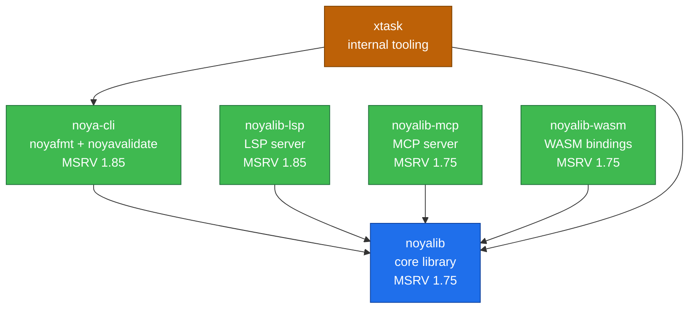

# Workspace dependency graph

The shape of crate-to-crate dependencies inside the noyalib
workspace. The arrows read "depends on" — `noya-cli → noyalib`
means `noya-cli` pulls `noyalib` from the workspace.



## Reading the graph

**`noyalib`** is the only crate with no internal dependencies — it
is the root of the workspace. Every other crate sits downstream
of it. This is enforced architecturally: `noyalib` cannot import
from `noya-cli`, `noyalib-lsp`, etc., even via tests.

**Satellite crates** (`noya-cli`, `noyalib-lsp`, `noyalib-mcp`,
`noyalib-wasm`) depend only on `noyalib`. They never depend on each
other, even when their feature surface overlaps. The MCP server
and the LSP server, for instance, both implement `format` and
`parse` operations, but each does so by calling `noyalib::cst::format`
directly — neither imports from the other. This keeps the per-crate
dependency footprint minimal and the integration tests independent.

**`xtask`** is the build-tooling crate (`cargo xtask completions`,
`cargo xtask manpages`, etc.). It pulls in `noya-cli` to call the
shared clap-derive command builders, and `noyalib` transitively.
It is `publish = false` and never ships to crates.io.

## MSRV layering

| Crate | MSRV | Reason |
|---|---|---|
| `noyalib` | **1.75.0** | Pure-library code; the workspace's lowest-common-denominator floor |
| `noyalib-mcp` | 1.75.0 | Stays at the core floor — only depends on `noyalib` and `serde_json` |
| `noyalib-wasm` | 1.75.0 | wasm-bindgen toolchain compatible at this floor |
| `noya-cli` | **1.85.0** | `clap_builder 4.6` is edition-2024 |
| `noyalib-lsp` | **1.85.0** | LSP transport stack (`litemap 0.7.5`, `uuid 1.23`) is edition-2024 |
| `xtask` | 1.85.0 | Inherits the higher floor via `noya-cli` |

CI's `Per-crate MSRV` job enforces these floors per crate — the
`noyalib` core can be picked up by 1.75-pinned downstream
projects even though the CLI binaries require 1.85. This is the
explicit value of the split graph.

## External dependency surface

Each crate's external (non-workspace) dependency count, default
profile:

| Crate | Runtime deps | Dev deps |
|---|---|---|
| `noyalib` | 8 (5 lean) | 8 |
| `noya-cli` | 2 (clap, miette) | 1 (criterion) |
| `noyalib-lsp` | 2 (serde, serde_json) | 1 (criterion) |
| `noyalib-mcp` | 2 (serde, serde_json) | 1 (criterion) |
| `noyalib-wasm` | 4 (wasm-bindgen et al.) | 1 (wasm-bindgen-test) |
| `xtask` | 3 (clap, clap_complete, clap_mangen) | 0 |

The `noyalib` lean profile (`--no-default-features --features
["std"]` or the `minimal` alias) drops to 5 — `itoa`, `ryu`, and
`serde_ignored` become opt-in via `fast-int`, `fast-float`, and
`strict-deserialise`. See [ADR 0001](../adr/0001-cst-rowan-shape.md)
for the architectural rationale and the per-crate README for the
opt-in matrix.

## Generating this graph

To regenerate the dot graph from the live workspace:

```sh
cargo depgraph --workspace-only --dedup-transitive-deps | dot -Tsvg > /tmp/deps.svg
```

`cargo-depgraph` is in `[dev-dependencies]` for the workspace; its
output is the source of truth for the Mermaid above. When the graph
shape changes (new crate added, dep direction reversed) update both
this file and [`doc/ARCHITECTURE.md`](../ARCHITECTURE.md).
