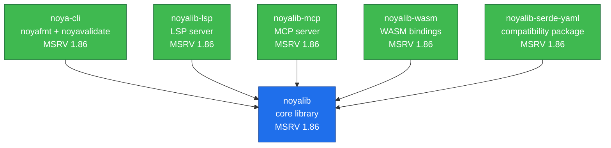

# Ecosystem dependency graph

The shape of repository-to-repository dependencies across the noyalib
ecosystem. The arrows read "depends on". Each satellite is released from
its own repository; the core workspace contains only `noyalib`.



## Reading the graph

**`noyalib`** is the only repository with no ecosystem dependencies. It
is the root of the graph. Every satellite sits downstream
of it. This is enforced architecturally: `noyalib` cannot import
from `noya-cli`, `noyalib-lsp`, etc., even via tests.

**Satellite crates** (`noya-cli`, `noyalib-lsp`, `noyalib-mcp`,
`noyalib-wasm`, `noyalib-serde-yaml`) depend only on `noyalib`. They never depend on each
other, even when their feature surface overlaps. The MCP server
and the LSP server, for instance, both implement `format` and
`parse` operations, but each does so by calling `noyalib::cst::format`
directly — neither imports from the other. This keeps the per-crate
dependency footprint minimal and the integration tests independent.

There is no `xtask` crate. It was the build-tooling crate
(it provided the `completions` and `manpages` subcommands) and was
retired with the workspace split (#134): man pages and shell
completions belong to `noya-cli`, which generates them in its own
repository. What remains here runs from `Makefile` targets
(`make sbom`, `make notice`, `make vendor`) and `scripts/`.

## MSRV (single lockstep floor)

| Crate | MSRV | Reason |
|---|---|---|
| `noyalib` | **1.86.0** | Single lockstep floor since v0.0.16; the lowest toolchain the project builds *and tests* on (`criterion 0.8` dev-dep requires 1.86) |
| `noyalib-mcp` | 1.86.0 | Lockstep with the core floor |
| `noyalib-wasm` | 1.86.0 | Lockstep with the core floor; wasm-bindgen 0.2 floors at 1.86 |
| `noya-cli` | 1.86.0 | Lockstep with the core floor; `clap_builder 4.6` is edition-2024 |
| `noyalib-lsp` | 1.86.0 | Lockstep with the core floor; LSP transport stack (`litemap`, `uuid`) is edition-2024 |
| `noyalib-serde-yaml` | 1.86.0 | Lockstep compatibility surface for `serde_yaml` consumers |

CI's `Per-crate MSRV` job still enforces the floor per crate — it reads
each `crates/*/Cargo.toml`'s `rust-version` and compiles against exactly
that — so a satellite adopting a higher floor cannot silently drag the
core up with it. The mechanism that kept the floors independent is
intact; what changed in v0.0.16 is only the numbers it reads.

As of v0.0.16 every crate declares 1.86.0. The binding constraint is
`criterion 0.8`, a **dev-dependency**: with `rust-version` temporarily
set to 1.85, `cargo +1.85.0 check --lib` compiles cleanly but
`cargo +1.85.0 check --all-targets` fails with
`criterion@0.8.2 requires rustc 1.86`. So no test, bench or coverage run
can execute below 1.86, and the project publishes the floor it verifies
rather than the lower one the library alone would reach.

No *runtime* dependency of the core crate requires 1.86 — the highest
runtime floor in the tree is 1.85. The earlier claim that
`validate-schema`'s ICU chain forced 1.86 was an artefact of a lockfile
refresh that did not ship; see `CHANGELOG.md` for v0.0.16.

## External dependency surface

Dependency counts change with lockfile and feature resolution, so this page
does not copy a hand-maintained table. The weekly ecosystem scorecard records
the current runtime closure for all six repositories; use
[`docs/ECOSYSTEM.md`](../ECOSYSTEM.md) for that evidence.

## Generating this graph

To inspect the core workspace graph:

```sh
cargo depgraph --workspace-only --dedup-transitive-deps | dot -Tsvg > /tmp/deps.svg
```

The cross-repository Mermaid graph is maintained from the repository list used
by `scripts/ecosystem-scorecard.sh`. When that list changes, update this file
and [`docs/ARCHITECTURE.md`](../ARCHITECTURE.md).
