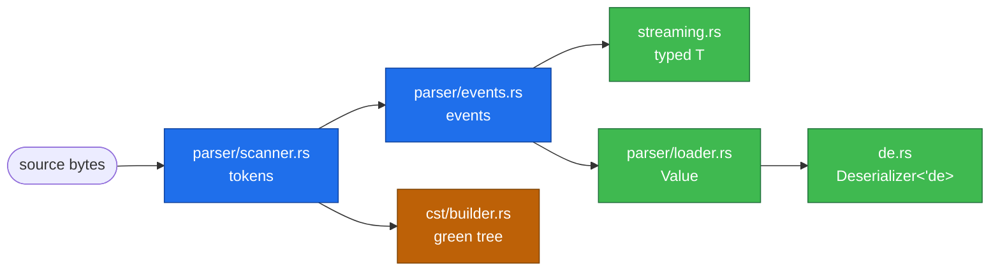

<!-- SPDX-FileCopyrightText: 2026 Noyalib -->
<!-- SPDX-License-Identifier: MIT OR Apache-2.0 -->

# Internals

A map of the crate for people changing it. Read
[ARCHITECTURE.md](ARCHITECTURE.md) first for *why* the pieces are
shaped this way; this is *where* they are.

**Generated** by `scripts/generate-reference-docs.sh`. Do not edit by
hand. `tests/reference_docs_are_complete.rs` fails when a module
exists that this map does not list.

## Hot paths

The longest functions in the crate. Length is a proxy, not a verdict —
a scanner's token dispatch is long because a YAML token has many
shapes — but these are where the time goes and where a change is most
likely to cost something. The `benches/` directory measures them.

| Lines | Location | Function |
| --- | --- | --- |
| 603 | `src/cst/document.rs` | `insert_entry_value` |
| 510 | `src/cst/document.rs` | `is_flow_collection` |
| 372 | `src/parser/loader.rs` | `process_event` |
| 302 | `src/parser/loader.rs` | `process_event` |
| 298 | `src/parser/scanner/scalars.rs` | `scan_block_scalar` |
| 234 | `src/cst/document.rs` | `entry_line_span` |
| 230 | `src/parser/loader.rs` | `push_node` |
| 214 | `src/parser/scanner/scalars.rs` | `scan_double_quoted_scalar` |
| 200 | `src/parser/scanner.rs` | `fetch_tag` |
| 198 | `src/parser/scanner.rs` | `fetch_value` |
| 177 | `src/parser/loader.rs` | `push_value` |
| 167 | `src/parser/events.rs` | `parse_node` |

## Module map

68 modules.

| Module | Lines | Purpose |
| --- | --- | --- |
| `anchors.rs` | 1151 | Smart pointer anchor types for shared/DAG structures. |
| `ariadne_adapter.rs` | 99 | [`ariadne`] adapter for [`crate::Error`]. |
| `base64.rs` | 262 | Internal base64 codec for `!!binary` scalars (YAML 1.2.2 §10.4). |
| `borrowed.rs` | 869 | Zero-copy YAML values that borrow strings from the input. |
| `comments.rs` | 244 | Comment capture on the parse path. |
| `compat/mod.rs` | 19 | Compatibility shims for downstream crates migrating to `noyalib`. |
| `compat/serde_yaml.rs` | 920 | Drop-in API surface compatible with `serde_yaml` 0.9. |
| `cst/anchor.rs` | 709 | Anchor and alias management. |
| `cst/annotated.rs` | 905 | Comment-aware read view over a [`crate::cst::Document`]. |
| `cst/builder.rs` | 597 | Build the parts of a [`crate::cst::Document`] from input bytes. |
| `cst/coerce.rs` | 232 | Lossless schema-driven type coercion on the CST path. |
| `cst/document.rs` | 7684 | Public `Document` handle and parse / mutation entry points. |
| `cst/emit.rs` | 463 | Auto-formatting for values spliced by the CST insertion mutators. |
| `cst/entry.rs` | 671 | Path-shaped mutable handle to a CST node — the `Entry` "pro" |
| `cst/format.rs` | 455 | Formatter for YAML CST. |
| `cst/green.rs` | 231 | Immutable green-node primitive with relative-length leaves. |
| `cst/mod.rs` | 126 | Side-table CST (concrete syntax tree) for lossless round-tripping. |
| `cst/syntax.rs` | 135 | Syntax-kind tags for green-tree nodes and tokens. |
| `de/config.rs` | 1177 | Parser configuration types. |
| `de/deserializer.rs` | 1041 | The serde `Deserializer` over a `&Value` and its access types. |
| `de.rs` | 1137 | YAML Deserialization. |
| `diagnostic.rs` | 188 | Spanned value to `miette::Report` bridge. |
| `doc_boundary.rs` | 217 | Workspace-private `---` document-boundary scanner. |
| `document.rs` | 436 | Multi-document YAML loading. |
| `error.rs` | 2137 | Error handling types. |
| `figment.rs` | 81 | [`figment`] provider for noyalib YAML. |
| `flattened.rs` | 165 | `Flattened<T>` — capture the underlying [`Value`] alongside the |
| `fmt.rs` | 635 | Formatting wrappers for fine-grained control over YAML output style. |
| `i18n.rs` | 172 | Pluggable error-message formatters for user-facing rendering. |
| `include.rs` | 316 | `!include` directive support — compose YAML documents from |
| `interner.rs` | 304 | Key interning for memory-efficient repeated-key workloads. |
| `lossless_float.rs` | 180 | A float that refuses to silently lose information. |
| `macros.rs` | 99 | Declarative builders for the public config types. |
| `parallel.rs` | 356 | Parallel multi-document YAML parsing — the "MapReduce" path. |
| `parser/budget.rs` | 253 | The resource budgets the loaders enforce, as pure predicates. |
| `parser/events.rs` | 783 | YAML 1.2 event-based parser. |
| `parser/loader.rs` | 2540 | Event-to-Value tree builder with security limits. |
| `parser/mod.rs` | 103 | Native YAML 1.2 parser. |
| `parser/scanner/scalars.rs` | 1191 | Scalar scanning for the YAML scanner: plain, single/double-quoted |
| `parser/scanner.rs` | 2312 | YAML 1.2 lexical scanner. |
| `path.rs` | 867 | Path tracking for YAML structure locations. |
| `policy.rs` | 271 | Pluggable parser policies for "Safe YAML" enforcement. |
| `recovery.rs` | 581 | Error-recovering YAML parser for LSP / IDE partial parsing. |
| `schema.rs` | 334 | YAML 1.2 schema validation helpers. |
| `schema_codegen.rs` | 322 | JSON Schema codegen for Rust types. |
| `schema_validate.rs` | 704 | JSON Schema 2020-12 validation against a parsed [`crate::Value`]. |
| `ser.rs` | 2390 | YAML serialization. |
| `simd.rs` | 1531 | SIMD-friendly structural-scanning primitives. |
| `span_context.rs` | 176 | Thread-local span context for wiring source locations into `Spanned<T>`. |
| `spanned.rs` | 291 | Source location tracking for deserialized values. |
| `streaming.rs` | 2358 | Streaming YAML deserializer that operates directly on parser events. |
| `sval_adapter.rs` | 442 | `sval` adapter — stream noyalib values through any |
| `tag_registry.rs` | 211 | Streaming-path registry for custom YAML tag pass-through. |
| `tokio_async.rs` | 547 | Native async YAML parsing for [`tokio`](https://tokio.rs) |
| `validated.rs` | 262 | Declarative validation via [`garde`] or [`validator`]. |
| `validated_miette.rs` | 265 | [`Spanned<T>`] + `garde` / `validator` → `miette::Report` |
| `value/arbitrary_impls.rs` | 150 | [`arbitrary::Arbitrary`] for the public value types, behind the |
| `value/convert.rs` | 237 | `From<T> for Value` conversions and `Index`/`IndexMut`. |
| `value/mapping.rs` | 1356 | YAML mapping types (`Mapping`, `MappingAny`). |
| `value/number.rs` | 631 | YAML number type (`Number`). |
| `value/serde_impl.rs` | 335 | serde `Serialize`/`Deserialize` for `Value`. |
| `value/tag.rs` | 505 | YAML tag types (`Tag`, `TaggedValue`) and tag utilities. |
| `value.rs` | 1723 | YAML value types. |
| `with/mod.rs` | 54 | Helper modules for customizing serialization and deserialization. |
| `with/singleton_map.rs` | 212 | Serialize enums as single-entry maps. |
| `with/singleton_map_optional.rs` | 265 | Serialize optional enums as single-entry maps. |
| `with/singleton_map_recursive.rs` | 176 | Recursively serialize enums as single-entry maps. |
| `with/singleton_map_with.rs` | 460 | Serialize enums as single-entry maps with custom key transformation. |

## Features

28 features, read from `crates/noyalib/Cargo.toml`.

| Feature | Enables | Notes |
| --- | --- | --- |
| `default` | `std`, `fast-int`, `fast-float`, `strict-deserialise` | — |
| `fast-int` | `dep:itoa` | Branchless integer formatting via `itoa` (~10× faster than `Display::fmt` on integer scalars). Disabling drops the dep and falls back to `core::fmt`; output is identical, only the serializer hot path slows down. |
| `fast-float` | `dep:ryu` | Branchless float formatting via `ryu` (Grisu-style algorithm). Disabling drops the dep and falls back to Rust's `{:?}` Debug format, which preserves float-ness (`1.0` stays `1.0`) but emits expanded decimal form for very large magnitudes (`{:?}` does not auto-switch to scientific notation the way ryu does). |
| `strict-deserialise` | `dep:serde_ignored` | `from_str_strict` / `from_slice_strict` / `from_reader_strict` — surface YAML keys that the target struct does not declare as typed `Error::UnknownField`. Backed by `serde_ignored`. Off in the `minimal` profile for FIPS / embedded users with strict dep-budget policies; the regular `from_str` path is unaffected. |
| `minimal` | `std` | Meta-feature: alias for "std-only, no formatting accelerators, no strict-deserialise helper" — for users with strict dep budgets (FIPS, embedded, audit-heavy environments) who want one explicit opt-in. Equivalent to `default-features = false, features = ["std"]`. |
| `std` | `serde_core/std`, `indexmap/std`, `rustc-hash/std`, `memchr/std` | Synchronise serde's std mode with ours so the `serde_core::de::Error` trait's `StdError` super-trait resolves consistently. With this wired, `cargo build --no-default-features` truly compiles in no_std and serde's de::Error does not require `std::error::Error`. |
| `miette` | `dep:miette`, `std` | `miette` 7 requires `std` (its `Diagnostic` supertrait is `std::error::Error`), so the feature implies it — the combination `--no-default-features --features miette` never compiled without this, caught by the feature-powerset sweep. |
| `ariadne` | `dep:ariadne` | — |
| `lossless-float` | — | Opt-in `LosslessFloat` — deserialization rejects infinities, NaN, and any value that loses precision as f64; the floating-point sibling of `lossless-u64`. Needs nothing beyond the mandatory `serde_core`. |
| `include` | — | `!include` directive — post-parse walk that consults a user-supplied `crate::include::IncludeResolver` for every `Value::Tagged(!include, _)` node and substitutes the resolved content in-place. Pairs with `max_include_depth` for cycle bounding. Off by default so callers who never see `!include` scalars pay zero compile cost. |
| `include_fs` | `include`, `std` | Filesystem-backed `crate::include::SafeFileResolver` (root sandbox, symlink policy). Implies `include` + `std`. |
| `garde` | `dep:garde` | — |
| `validator` | `dep:validator` | — |
| `wasm-opt` | — | — |
| `noyavalidate` | `std`, `miette`, `miette/fancy`, `validate-schema` | — |
| `compat-serde-yaml` | `lossless-u64` | Drop-in surface compatible with `serde_yaml` 0.9. Adds the `noyalib::compat::serde_yaml` module with name-for-name re-exports and the `Error` parity needed for logic-transparent migration — every type the shim exposes is a noyalib-native type, not a re-export of the archived upstream crate. Off by default so users who do not need migration help do not see the extra surface. The shim needs `lossless-u64` for its integer-precision contract (`u64::MAX` survives the serde_json path exactly, as upstream). |
| `lossless-u64` | — | Opt-in unsigned integer model for YAML `!!int` scalars in the `i64::MAX + 1..=u64::MAX` range. Dependency-free; off by default because it exposes an additional public `Number` variant. |
| `schema` | `dep:schemars`, `dep:serde_json` | JSON Schema codegen via `schemars`. With this on you can `#[derive(noyalib::JsonSchema)]` for a Rust type and call `noyalib::schema_for::<T>()` / `schema_for_yaml::<T>()` to obtain the schema as a `Value` or as YAML text. Schema *validation* of YAML against the schema is covered by Phase 3.2 (CLI surface). |
| `validate-schema` | `schema`, `dep:jsonschema` | JSON Schema validation engine. With this on you can call `noyalib::validate_against_schema(value, schema)` to enforce a JSON Schema 2020-12 contract against parsed YAML data. Implies `schema` so the codegen and validation halves of Phase 3 can be enabled together with one flag. |
| `figment` | `dep:figment`, `std` | `figment` provider integration. With this on, `noyalib::figment` exposes a `Yaml` provider that drops into `figment::Figment` layering chains the same way `figment::providers::Toml` / `figment::providers::Json` do. |
| `simd` | — | SIMD-friendly multi-byte search primitives for parser hot paths. Ships a feature-gated `noyalib::simd` module containing `find_any_of` and friends — vectorised via memchr's SSE2 / NEON arity-1/2/3 primitives where applicable, SWAR (8-byte-stride u64 packing) for needle sets of 4+ bytes, and a scalar fallback. Pure-safe Rust (no `unsafe`) — preserves the workspace `unsafe_code = "forbid"` invariant. Off by default so the most conservative environments stay on the byte-by-byte baseline; on by callers who want the throughput uplift on supported targets. |
| `compare-saphyr` | `dep:serde-saphyr` | Opt-in cross-library benchmark comparison against `serde-saphyr`. Off by default because the saphyr crate's manifest requires Rust 2024 edition (Cargo 1.85+). Enabling this feature pulls saphyr in as a dev-dep and gates the comparison bench arms on its presence. |
| `tokio` | `dep:tokio`, `dep:tokio-util`, `dep:bytes`, `std` | Native async stream parsing on top of `tokio::io::AsyncRead`. Adds `noyalib::tokio_async` with `from_async_reader`, `from_async_reader_multi`, and a `YamlDecoder` codec for `tokio_util::codec::Framed` pipelines. Off by default to keep the dep list lean for sync-only callers. |
| `sval` | `dep:sval` | `sval` zero-allocation streaming serialization framework adapter. Adds `impl sval::Value for Value` (and the other in-tree value types) plus a `noyalib::sval_adapter::to_sval_writer` entry point. serde remains the default; this is opt-in for callers that want to skip serde monomorphisation overhead. |
| `arbitrary` | `dep:arbitrary`, `std` | Structure-aware fuzzing and property testing: `arbitrary::Arbitrary` for every public value type. The arbitrary crate needs std. |
| `recovery` | `std` | Error-recovering parser for LSP / IDE partial parsing. Adds the `noyalib::recovery` module with `parse_lenient` / `parse_lenient_with` entry points returning a `ParseResult` carrying the best-effort tree plus the collected error list. Pure Rust, no extra deps — turns existing strict-parse retries into a recovery pipeline. Off by default because the strict path is what most callers want. |
| `parallel` | `dep:rayon`, `std` | Parallel multi-document deserialisation via Rayon. Adds the `noyalib::parallel` module: - `parallel::parse<T>(&str) -> Result<Vec<T>>` — typed deserialise. - `parallel::values(&str) -> Result<Vec<Value>>` — dynamic-tree variant. - `parallel::split(&str) -> Vec<&str>` — exposed boundary scanner for callers driving their own concurrency primitives. All three pre-scan `---` document boundaries on a single thread then deserialise each document in parallel via Rayon's global thread pool. Off by default to keep the runtime dep list lean for users that only parse single-document inputs. |
| `nightly-simd` | `simd` | Portable-SIMD (`std::simd`) structural scanner. Builds a 16/32/ 64-byte-wide `SimdScanner` that finds any byte in a needle set in a single SIMD pass. Requires the nightly toolchain because `core::simd` is unstable (`#![feature(portable_simd)]`). On by default for nightly users who want maximum throughput; the stable `simd` feature still ships the memchr / SWAR fall-back so stable builds are not regressed. |

<!-- SPDX-FileCopyrightText: 2026 Noyalib -->
<!-- SPDX-License-Identifier: MIT OR Apache-2.0 -->
<!--
Prose appendix for docs/internals.md.

scripts/generate-reference-docs.sh generates the inventory half of that
document (hot paths, module map, feature table) and appends this file
verbatim. Edit the architecture notes here; never edit docs/internals.md,
which is overwritten.

The feature table is NOT here on purpose: it used to be hand-written in
crates/noyalib/docs/internals.md, where it drifted into documenting a
`robotics` feature that does not exist and a `load_all_as_parallel`
function that was never in the source. It is generated from Cargo.toml.
-->

## The two parse paths

noyalib has two *parallel* parse paths that share the scanner
token stream:



- **Streaming path** (default for `from_str::<T>`): events are
  consumed lazily, deserialised directly into `T`, no `Value`
  intermediate. Lowest memory + fastest.
- **Loader path** (used when the caller wants a dynamic-shape
  `Value`, span-tracking, or strict-mode unknown-key detection):
  events build a full `Value` tree first, then `Deserializer<'de>`
  walks it.
- **CST path** (used by `cst::Document`): tokens build the
  byte-faithful green tree. Comments, whitespace, and indent are
  preserved. Distinct from the data paths — see
  [ADR 0001](adr/0001-cst-rowan-shape.md).

## Where YAML 1.1 vs 1.2 resolves

Plain-scalar resolution is a single conceptual step: "given the
text `0644`, is it `int 644` or `int 420`?" The answer depends on
`ParserConfig::version` and the three `legacy_*` flags.

The actual resolution code lives in two places:

- **Streaming path**: `streaming.rs::resolve_plain_scalar`. Called
  inline as scalar events are consumed; no `Value` allocation.
- **Loader path**: `parser/loader.rs::value_to_key_string` plus
  inline matches in the loader. Operates on `Value`.

Both read the same `ParserConfig` and produce the same result; the
resolution table is duplicated by design (one is hot-path
streaming, one is value-shaped) but kept in lockstep by the
`tests/legacy_sexagesimal.rs` and `tests/yaml_version.rs`
integration tests.

## CST surface

`cst::Document` is the lossless tooling surface. It is feature-gated
behind `std` because it uses thread-local storage for span
attachment.

```text
cst::
├── Document          # the parse/edit unit — single document
├── Cursor            # navigation handle into the green tree
├── format            # `format(s)` — round-trip via CST
├── format_with_config
├── parse_document    # explicit parse-without-format
└── ...
```

Mutation goes through `Document::set(path, value)` /
`Document::replace_span(...)`. The green tree is immutable;
mutation produces a new tree with structural sharing where the
edit didn't reach.

## Where to add new code

| Adding… | Goes in |
|---|---|
| New `ParserConfig` field | `de.rs` (struct), `streaming.rs` + `loader.rs` (consumers) |
| New `Error` variant | `error.rs` (enum + Display + miette code/help) |
| New deserialisation helper (`from_X_strict`, etc.) | `de.rs` |
| New custom-tag handler | route via `tag_registry.rs` |
| New CST edit operation | `cst/document.rs` |
| New `Value` query method | `value.rs` |
| New scanner state / token kind | `parser/scanner.rs` |
| New SIMD / SWAR primitive | `simd.rs` (feature-gated) |
| New compat shim for upstream lib | `compat/<lib>.rs` (new file, gate behind `compat-<lib>` feature) |
