<!-- SPDX-FileCopyrightText: 2026 Noyalib -->
<!-- SPDX-License-Identifier: MIT OR Apache-2.0 -->
<!--
Prose appendix for docs/internals.md.

scripts/generate-reference-docs.sh generates the inventory half of that
document (hot paths, module map, feature table) and appends this file
verbatim. Edit the architecture notes here; never edit docs/internals.md,
which is overwritten.

The feature table is NOT here on purpose: it used to be hand-written in
crates/noyalib/docs/internals.md, where it drifted into documenting a
`robotics` feature that does not exist and a `load_all_as_parallel`
function that was never in the source. It is generated from Cargo.toml.
-->

## The two parse paths

noyalib has two *parallel* parse paths that share the scanner
token stream:

```mermaid
graph LR
    src([source bytes]) --> scanner[parser/scanner.rs<br/>tokens]
    scanner --> events[parser/events.rs<br/>events]
    events --> streaming[streaming.rs<br/>typed T]
    events --> loader[parser/loader.rs<br/>Value]
    loader --> deserializer[de.rs<br/>Deserializer&lt;'de&gt;]
    scanner --> cst_builder[cst/builder.rs<br/>green tree]

    classDef shared fill:#1f6feb,stroke:#0d419d,color:#fff
    classDef datapath fill:#3fb950,stroke:#1f6f3a,color:#fff
    classDef cstpath fill:#bd6107,stroke:#7d4101,color:#fff
    class scanner,events shared
    class streaming,loader,deserializer datapath
    class cst_builder cstpath
```



- **Streaming path** (default for `from_str::<T>`): events are
  consumed lazily, deserialised directly into `T`, no `Value`
  intermediate. Lowest memory + fastest.
- **Loader path** (used when the caller wants a dynamic-shape
  `Value`, span-tracking, or strict-mode unknown-key detection):
  events build a full `Value` tree first, then `Deserializer<'de>`
  walks it.
- **CST path** (used by `cst::Document`): tokens build the
  byte-faithful green tree. Comments, whitespace, and indent are
  preserved. Distinct from the data paths — see
  [ADR 0001](adr/0001-cst-rowan-shape.md).

## Where YAML 1.1 vs 1.2 resolves

Plain-scalar resolution is a single conceptual step: "given the
text `0644`, is it `int 644` or `int 420`?" The answer depends on
`ParserConfig::version` and the three `legacy_*` flags.

The actual resolution code lives in two places:

- **Streaming path**: `streaming.rs::resolve_plain_scalar`. Called
  inline as scalar events are consumed; no `Value` allocation.
- **Loader path**: `parser/loader.rs::value_to_key_string` plus
  inline matches in the loader. Operates on `Value`.

Both read the same `ParserConfig` and produce the same result; the
resolution table is duplicated by design (one is hot-path
streaming, one is value-shaped) but kept in lockstep by the
`tests/legacy_sexagesimal.rs` and `tests/yaml_version.rs`
integration tests.

## CST surface

`cst::Document` is the lossless tooling surface. It is feature-gated
behind `std` because it uses thread-local storage for span
attachment.

```text
cst::
├── Document          # the parse/edit unit — single document
├── Cursor            # navigation handle into the green tree
├── format            # `format(s)` — round-trip via CST
├── format_with_config
├── parse_document    # explicit parse-without-format
└── ...
```

Mutation goes through `Document::set(path, value)` /
`Document::replace_span(...)`. The green tree is immutable;
mutation produces a new tree with structural sharing where the
edit didn't reach.

## Where to add new code

| Adding… | Goes in |
|---|---|
| New `ParserConfig` field | `de.rs` (struct), `streaming.rs` + `loader.rs` (consumers) |
| New `Error` variant | `error.rs` (enum + Display + miette code/help) |
| New deserialisation helper (`from_X_strict`, etc.) | `de.rs` |
| New custom-tag handler | route via `tag_registry.rs` |
| New CST edit operation | `cst/document.rs` |
| New `Value` query method | `value.rs` |
| New scanner state / token kind | `parser/scanner.rs` |
| New SIMD / SWAR primitive | `simd.rs` (feature-gated) |
| New compat shim for upstream lib | `compat/<lib>.rs` (new file, gate behind `compat-<lib>` feature) |
